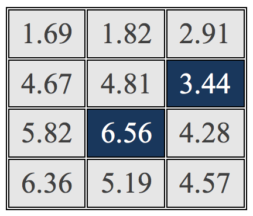

# {.tabset}
##**Literature Review & Research Opportunity**
###**Notes From the Literature**

**1. [Framing effects](http://science.sciencemag.org/content/211/4481/453)**: Alternate descriptions of the same choices---or potential future outcomes tied to such choices---either as a gain or loss often leads people to make different decisions.

**2. [Loss aversion](https://academic.oup.com/qje/article-abstract/106/4/1039/1873382)**: People tend to do more to avoid a loss than to acquire an equivalent gain; psychologically, losses hurt more than gains feel good.

**3. [Strength model of self-control](https://journals.sagepub.com/doi/abs/10.1111/j.1467-8721.2007.00534.x)**: Self-control is a limited resource that can become depleted with extensive use, much like an overused muscle.

###**Motivating Literature**

**1. [Mead et al., (2009)](https://www.sciencedirect.com/science/article/pii/S0022103109000365):**

This study employed a two (i.e. self-control depletion: depleted/non-depleted) by two (i.e. cheating: opportunity/no opportunity) dimentional experimental design (i.e. four treatment blocks) in which participants completed a short essay task followed by a matrices solving task, in order to test the effects of self-control depletion on dishonesty.

For the essay task, participants were instructed to write a short essay describing a recent vacation that they took. The self-control depletion/non-depletion treatment dimension was introduced such that participants in depletion treatment groups had to write the essay without using the letters "a" and "n," which is considerably difficult to do, and those in the non-depletion treatment groups were simply not allowed to use the letters "x" and "z".

After completing their essay, participants were faced with the matrices solving task. For this task, all participants were shown the same series of 3x4 matrices similar to the example matrix below. For each of the matrices, their goal was to find the set of two numbers that added up exactly to 10. For example, in the matrix below, 3.44 and 6.56 add up exactly to 10.

{width=200px}

All participants were allotted the same amount of time to solve these matrices before their performance was evaluated. The opportunity to cheat (or lack thereof) was set up such that the matrices solving task was either self-reported by the participant (i.e. cheating condition) or evaluated by the experimenter (i.e. non-cheating condition).

Unsurprisingly, it was found that on average, there was much more cheating in the self-graded conditions relative to the experimenter-scored conditions. More importantly though, the results showed that when participants had the opportunity to cheat ***under self-report conditions, cheating behavior was magnified by self-control depletion.*** Moreover, an important feature of this study was that participants in the self-score condition groups were given an envelope filled with the full possible payment beforehand and were asked to return the amount equivalent to that which they that did not earn. Thus, the design was set up such that all participants, regardless of treatment group, operated under a loss frame.

**2. [Gino et al., (2011)](https://www.sciencedirect.com/science/article/pii/S0749597811000422):**

Employed a very similar experimental design as Mead et al. (2009), but instead of loss framing, gain framing was tested. Meaning, participants in self-scoring conditions were not endowed with the full possible incentive from the beginning of the experiment, and then asked to return whatever they didn't earn. Instead these participants were given nothing to begin with and were given (i.e. gained) compensation only after self-reporting. ***Under these purely gain framing conditions, again self-control depleted participants cheated more on average relative to participants who were not depleted.***

**3. [Grolleau et al., (2016)](https://pubsonline.informs.org/doi/abs/10.1287/mnsc.2015.2313):**

This study employed a two (i.e. framing: loss/gain ) by two (i.e. cheating: opportunity/no opportunity) dimentional experimental design (i.e. four treatment blocks) in which participants were faced with the same aforementioned matrices solving task, though under conditions only consisting of self-control non-depletion (i.e. participants were not treated with a depletion task). Ultimately, it was found that ***loss framing conditions led participants to cheat more on average relative to gain framing conditions.***

###**Research Opportunity**

We identify an opportunity to expand upon Mead et al. (2009) and Gino et al.(2011)---which established the effect of self-control depletion on cheating under loss and gain framing, respectively---to incorporate the findings of Grolleau et al. (2016)---which established that loss and gain frames have asymmetric effects on cheating behaviors---by ***looking at the interaction effects of self-control depletion/non-depletion and loss/gain framing.***

##**Hypotheses**
###**Hypothesis 1:**

Regardless of loss/gain framing, participants depleted of self-control will cheat more, on average, than non-depleted participants. As previously mentioned, several studies have found that on average, experimental participants depleted of self-control systematically cheat much more relative to non-depleted participants under otherwise similar conditions (Mead et al., 2009; Gino et al, 2011). Thus, the proposed study serves, in part, to replicate and substantiate the current body of literature on this topic. Hypothesis 1 can be formally written as:
$$H_0 : \mu_d = \mu_n$$
$$H_a : \mu_d > \mu_n$$
where $\mu_d$ is the cross-treatment meta-average rate/amount of cheating demonstrated by participants in the two depleted conditions (i.e. depleted_loss and depleted_gain) and $\mu_n$ is the cross-treatment meta-average rate/amount of cheating demonstrated by participants in the two non-depleted conditions (i.e. non-depleted_loss and non-depleted_gain). We expect to reject $H_0$, which says that there will be no statistically significant difference between $\mu_d$ and $\mu_n$, in favor of $H_a$, which says that $\mu_d$ will be statistically significantly greater than $\mu_n$.

&nbsp;

###**Hypothesis 2:**

Loss framing will lead to more cheating relative to gain framing, regardless of self-control depletion or lack thereof. Again, we expect such an effect in view of previous work that has demonstrated that people generally cheat more in order to avoid losses than to ensure gains (Grolleau et al., 2016). Hypothesis 2 can be formally written as:
$$H_0 : \mu_{l} = \mu_{g}$$
$$H_a : \mu_{l} > \mu_{g}$$
where $\mu_l$ is the cross-treatment meta-average rate/amount of cheating demonstrated by participants in the two loss framing conditions (i.e. depleted_loss and non-depleted_loss) and $\mu_g$ is the cross-treatment meta-average rate/amount of cheating demonstrated by participants in the two gain framing conditions (i.e. depleted_gain and non-depleted_gain). We expect to reject $H_0$, which says that there will be no statistically significant difference between $\mu_l$ and $\mu_g$, in favor of $H_a$, which says that $\mu_l$ will be statistically significantly greater than $\mu_g$.

&nbsp;

###**Hypothesis 3:**

The average rate/amount of cheating demonstrated will be greatest for participants who are depleted of self-control and operating under a loss frame. I also expect the average amount/rate of cheating demonstrated to be the second highest in the depletion_gain treatment group, followed closely by the non-depleted_loss group, and then lastly by the non-depleted_gain group. Hypothesis 3 can be formally written as:
$$H_0 : \mu_{dl} = \mu_{dg} = \mu_{nl} = \mu_{ng}$$
$$H_a : \mu_{dl} > \mu_{dg} > \mu_{nl} > \mu_{ng}$$
where $\mu_{dl}$ is the average rate/amount of cheating demonstrated by participants in the depleted_loss condition, $\mu_{dg}$ is that in the depleted_gain condition, $\mu_{nl}$ is that in the non-depleted_loss condition, and $\mu_{ng}$ is that in the non-depleted_gain condition. We expect to reject $H_0$, which says that there will be no statistically significant difference between $\mu_{dl}$, $\mu_{dg}$, $\mu_{nl}$, and $\mu_{ng}$, in favor of $H_a$, which says that $\mu_{dl}$ will be statistically significantly greater than $\mu_{dg}$, which will be statistically significantly greater than $\mu_{nl}$, which finally will be statistically significantly greater than $\mu_{ng}$.

No previous research that we can find directly informs this third hypothesis, though the combined findings from the aforementioned research that informs our expectation to reject the null hypothesis in both Hypotheses 1 and 2, leads us to also expect to reject the null in Hypothesis 3. We believe that the combined effect of both self-control depletion and loss framing should theoretically maximize cheating across the four treatments we intend to examine. Thus, our study also serves to expand and inform the current body of literature on the strength model of self-control, and loss/gain framing, as well as behavioral ethics.
